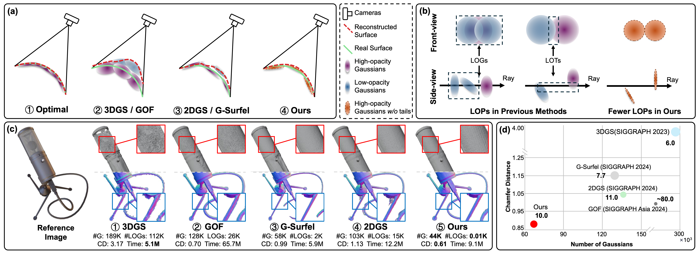

# Spiking GS: Towards High-Accuracy and Low-Cost Surface Reconstruction via Spiking Neuron-based Gaussian Splatting

## Overview
This is the official implementation of "Spiking GS: Towards High-Accuracy and Low-Cost Surface Reconstruction via Spiking Neuron-based Gaussian Splatting".

<a href="https://arxiv.org/abs/2410.07266">[Paper]</a> <a href="assets/supp.pdf">[Supp]</a> <a href="https://mp.weixin.qq.com/s/mREoMR28knWpB9bQ6LuZow">[中文]</a>



## Usage

### Training Data Preparation

* <a href="https://github.com/bmild/nerf">NeRF-Synthetic dataset</a> from original NeRF.
* <a href="https://github.com/BerkeleyAutomation/dex-nerf-datasets">Dex-NeRF dataset</a>, we use selected simulated scenes(singulated).
* <a href="https://drive.google.com/drive/folders/1SJFgt8qhQomHX55Q4xSvYE2C6-8tFll9">DTU dataset</a>, we use preprocessed data from <a href="https://github.com/hbb1/2d-gaussian-splatting">2DGS</a>. 

### Evaluation Data Preparation

* To eval NeRF-Synthetic dataset and Dex-NeRF dataset, we export GT meshes using blender, which can be downloaded <a href="https://drive.google.com/file/d/1Oc_txpgB6axhru0GrS6gmhSVkzpeRl2j/view?usp=drive_link">here</a>.
* To eval DTU dataset, we use STL point cloud from official <a href="https://roboimagedata.compute.dtu.dk/?page_id=36">DTU</a> repository as GT, and ObsMask is also needed. Following previous work, we use COLMAP to generate sfm point cloud for init. Preprocessed data that pre-organized can be downloaded <a href="https://drive.google.com/file/d/1H0AQuulNaRSiKjRAbJoAscJzg60VM7ei/view?usp=drive_link">here</a>. 

We provide pre-trained models <a href="https://drive.google.com/file/d/1E2TwEFPMVs1HZWxFDcOq9qQWXaJP_lxL/view?usp=drive_link">here</a> for quick evaluation (please check scripts we provided below for more details).

The data is organized as follows:   

```
Spiking GS

|-- blender_eval
|   |-- dex_nerf
|   |   |-- mount (scene name)
|   |       |-- train
|   |           |-- r_0.png
|   |           |-- r_1.png
|   |               ...
|   |           |-- mount_visible.ply (SceneName_visible.ply)
|   |           |-- transforms_train.json (sightly modified from training data)
|   |-- nerf_synthetic (same as dex_nerf)
|       ...
|-- dtu_eval
|   |-- ObsMask
|       |-- ObsMask24_10.mat (for scene 24)
|       |-- ObsMask37_10.mat (for scene 37)
|           ...
|       |-- Points
|           |-- stl
|               |-- stl024_total.ply (for scene 24)
|               |-- stl037_total.ply (for scene 37)
|                   ...
|       |-- sfm
|           |-- sfm_scene_24.json
|           |-- sfm_scene_37.json
|               ...
|-- data
    |-- nerf_synthetic
    |   |-- lego (scene name)
    |       |-- transforms_train.json    # camera parameters
    |       |-- transforms_test.json    # camera parameters
    |       |-- transforms_val.json    # camera parameters
    |       |-- train
    |           |-- r_00.png        # target image
    |           |-- r_01.png
    |           ...
    |       |-- test
    |           |-- r_00.png        # target image
    |           |-- r_01.png
    |           ...
    |       |-- val
    |           |-- r_00.png        # target image
    |           |-- r_01.png
    |           ...
    |-- dex_nerf (same as nerf_synthetic)
    |   ...
    |-- 2ddtu
        |-- scan24 (scene name)
            ....
```

### Setup

- Clone this repository.

- Run following command:
```shell
conda env create -f environment.yml
conda activate spiking-gs

pip install kornia

cd submodules/diff-gaussian-rasterization/
python setup.py install

cd ../simple-knn/
python setup.py install
``` 
**Note that we use open3d=0.9.0.0, which is an old version. If you use the latest version open3d, you need to adjust some open3d functions based on our repo.**

- Or install dependencies separately:
```shell
conda create --name spiking-gs python=3.7
conda activate spiking-gs
conda config --append channels pytorch3d
conda install cudatoolkit=11.6.2=hfc3e2af_13 gcc=8.5.0=h143be6b_10 gxx=8.5.0 ninja=1.7.2=0 plyfile=0.8.1=pyhd8ed1ab_0 \
  pytorch=1.12.1=py3.7_cuda11.6_cudnn8.3.2_0 pytorch3d=0.7.1=py37_cu116_pyt1121 torchaudio=0.12.1=py37_cu116 torchvision=0.13.1=py37_cu116 tqdm
pip install imageio wandb==0.16.2 tyro==0.6.4 trimesh==4.3.1  scikit-image==0.19.3 scikit-learn==1.0.2 scipy==1.5.1 open3d==0.9.0.0 opencv-python==4.9.0.80 plotly==5.18.0 kornia
```

### Training and Evaluation
**You might need to update the data path in the script accordingly.**
- **Script for NeRF-Synthetic**

```shell 
# nerf_synthetic dataset
bash ./script/full_eval_nerf.sh # check more details in the script
```

- **Script for Dex-NeRF**

```shell 
# dex-nerf dataset
bash ./script/full_eval_dex.sh # check more details in the script
```

- **Script for DTU**

```shell 
# dtu dataset
bash ./script/full_eval_dtu.sh # check more details in the script
```

## Acknowledgements
This project is mainly built upon <a href="https://github.com/graphdeco-inria/gaussian-splatting">3DGS</a>. Evaluation method is taken from <a href="https://github.com/AndreeaDogaru/SphereGuided">SphereGuided</a> and <a href="https://github.com/hbb1/2d-gaussian-splatting">2DGS</a>.


## Citation
    @article{zhang2024spiking,
        title={Spiking GS: Towards High-Accuracy and Low-Cost Surface Reconstruction via Spiking Neuron-based Gaussian Splatting},
        author={Zhang, Weixing and Li, Zongrui and Ma, De and Tang, Huajin and Jiang, Xudong and Zheng, Qian and Pan, Gang},
        journal={arXiv preprint arXiv:2410.07266},
        year={2024}
    }

**Repository Contributors**: [Weixing Zhang](https://github.com/shippoT), [Zongrui Li](https://zongrui.page), [Qian Zheng](https://person.zju.edu.cn/en/zq)
